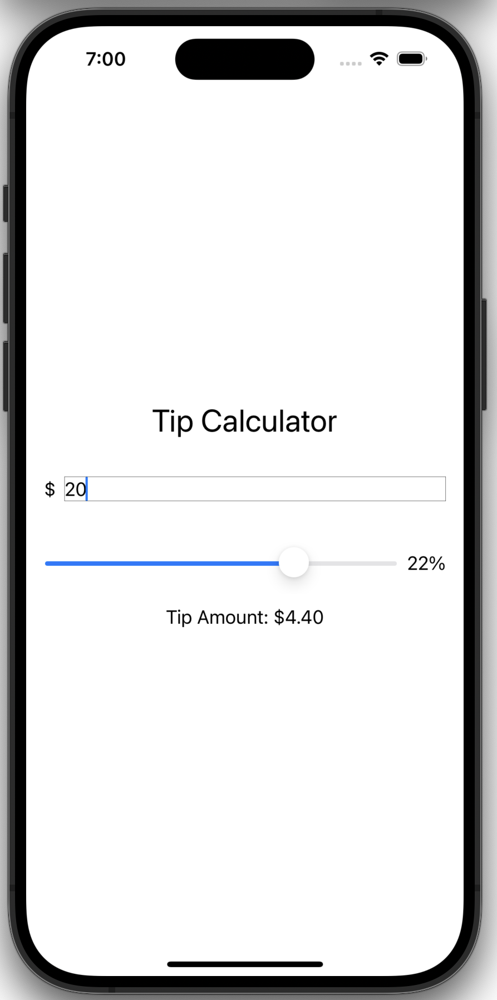

[](https://stand-with-ukraine.pp.ua)


# Tip Calculator

Tip Calculator is an iOS application for calculating a particular percentage of
tips of the total price received in receipt.
It is designed for educational purposes.
It demonstrates the basics of working with SwiftUI by providing a simple
interface to calculate the tip percentage of a given amount.

## Features

- **Single Screen**: The app has one screen with a text field to input a number
  and a “spinner” to adjust the tip percentage.
- **Real-Time Calculation**: As you adjust the spinner, the app recalculates and
  displays the tip amount in real-time.

## Getting Started

To run this project locally, you need to have Xcode installed on your machine.
Follow these steps:

- Clone the repository:

```bash
git clone https://github.com/Turskyi/Tip-Calculator.git
```

- Open the project in Xcode:

```bash
open Tip-Calculator.xcodeproj
```

- Build and run the project on the iOS Simulator or a physical device.

## Usage

This project is intended for educational purposes.
It allows users to see how a simple app works with SwiftUI.
The main feature is to calculate the percentage of an amount based on the tip
percentage set using the spinner.

## Technologies Used

• Operating system: [iOS](https://www.apple.com/ios/ios-14/);

• Programming language: [Swift](https://developer.apple.com/swift/);

• SDK: [iOS](https://developer.apple.com/);

• Interface: [SwiftUI](https://developer.apple.com/xcode/swiftui/).

•
Architecture: [Monolith](https://en.wikipedia.org/wiki/Monolithic_architecture)

## Contributing

Contributions are welcome!
If you would like to contribute, please create a pull request.

## License

This project does not have an intentional license.

## Screenshot:

<!--suppress CheckImageSize -->

